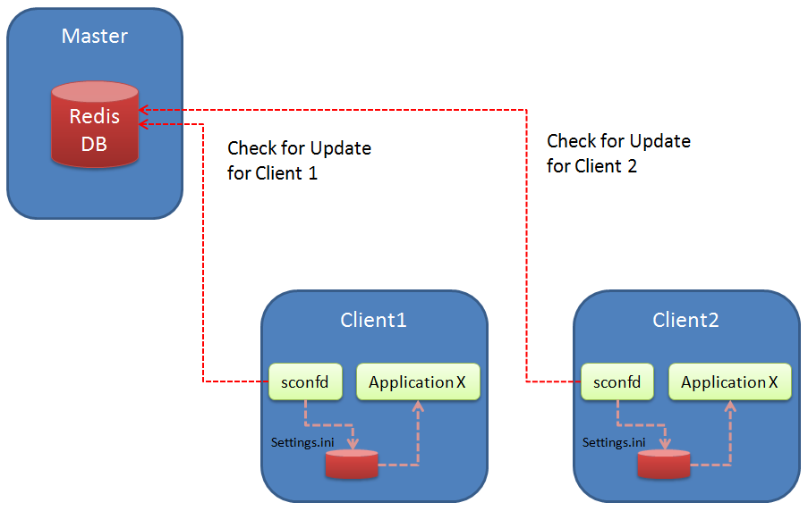
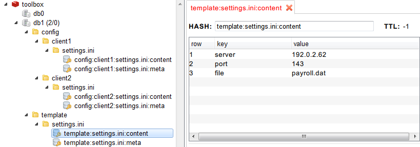
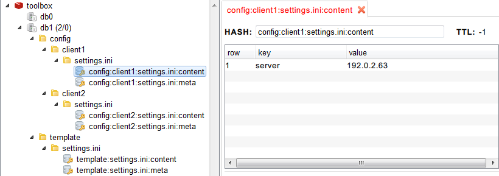

## sconfd version 0.1

Simple Configuration Daemon

A small tool / script which should help save ini configuration files centrally in a redis database. The files and changes to them (within the database) are monitored from each client (could be a virtual machine, docker container, etc.) and if changes occur the files are respectevly updated within the client.

Same result you may obtain using provisioning tools like puppet and/or chef, but I wanted to create a real lightweight and easy to customize tool.

Usually an application needs a restart to apply changes within config files, this is not in scope of the tool yet.


- Usage (python): __python sconfd.py &lt;client_id&gt;__
- Usage (Go): __go run sconfd.go &lt;client_id&gt;__
- Usage (Binary*): __./sconfd &lt;client_id&gt;__


*Binary is compiled on Linux Debian/64 Bit System, and should run standalone

### Architecture view
Indeed the architecture is very flexible, I would suggest to have a docker container running redis and the config tools / gui (as soon as they are ready) and sconfd in seperate docker containers which mount a volume for the configuration paths. As there is no security implemented, take care who has access to sconfd (use only in closed networks, e.g. for local developments). As this tool is a Python 2.7 script (Go coming soon), the script is fine to run outside a container if you have Python installed incl. redis module for python.

Sample architecture for 2 clients and 1 master (running database):



### Technical description
There are two main keyspace structures needed for running this tool:

__For the templates and the default values:__
- template
   - _filename_ -> filename of the configuration file (e.g. "settings.ini")
       - meta -> stores some meta information like needed seperator
       - content -> keys and their default configuration values

__For the client configuration instances:__
- config
    -  _client_id_ -> some kind of client id to identify a single container
       - _filename_ -> filename of the configuration file (e.g. "settings.ini")
           - meta -> stores some meta information like target directory of the file
           - content -> keys and their configuration values, if they differ from the template


Given an example configuration file with some fake data -  settings.ini:

```
server=192.0.2.62     
port=143
file="payroll.dat"
```

Example structure in redis for the ini file if we use 2 clients:

| Key Space     | Key          | Vale   | Description |
| :------------- | :------------- | :----- | :----------- |
|  template:settings.ini:meta     |   seperator | "=" | any seperator can be used , e.g. ":" as well - mandatory! |
|  template:settings.ini:content  | server      | 192.0.2.62 | content of the ini file |
|     | port  | 143 | content of the ini file |
|     | file | "payroll.dat" | content of the ini file |
| config:client1:settings.ini:meta  |   filepath | /home/user/myapp/config/settings.ini | target path where config file will be saved - mandatory! |
| config:client1:settings.ini:content | server  | 192.0.2.63 | content of the ini file, overwrite default/template value |
| config:client2:settings.ini:meta  |   filepath | /home/user/myapp/config/settings.ini | target path where config file|
| config:client2:settings.ini:content | server  | 192.0.2.64 | content of the ini file, overwrite default/template value   |
|     | file  | "payroll2.dat" | content of the ini file, overwrite default/template value  |


Screenshots of the structure:



The instance is overwriting the server IP config:



Resulting settings.ini for client1:
```
server=192.0.2.63    
port=143
file="payroll.dat"
```

Resulting settings.ini for client2:
```
  server=192.0.2.64    
  port=143
  file="payroll2.dat"
```

### Sample use case:
- Multiple docker containers running instances of a specific application
- Distribute config files (at the moment simple key-value files) to the containers
- Have a template (default config) of each config file and store only the changes for each specific client
- If template or instance of a config file is changed, update the application config file
- To sum up: make an easy to apply central config management possible, even if applications don't store their condfigurations in databases


__Example for docker__

In order to connect to the host redis database:

```alias hostip="ip route show 0.0.0.0/0 | grep -Eo 'via \S+' | awk '{ print \$2 }'"```

Run Docker with the application image:  

```docker run --add-host=docker:$(hostip) -v /tmp/:/data -it *image* /bin/bash```


### Open Topics, for next version
- Create description and sample docker images for testing
- Handle parameter / argument list, show usage
- Handle sections (not supported at the moment, might work with some tweaks)
- More testing, e.g. if no client content is given...how to handle?
- Create a small admin GUI (as no tried Redis GUI is running stable) to facilitate
   - importing templates
   - creating instances of config files
   - manage clients
   - check the actual configuration and compare them to the default values
- create some kind of client tracking within the database
- make script more robust (e.g. if instances of client configs are not available)
- remove hard coded database selection
